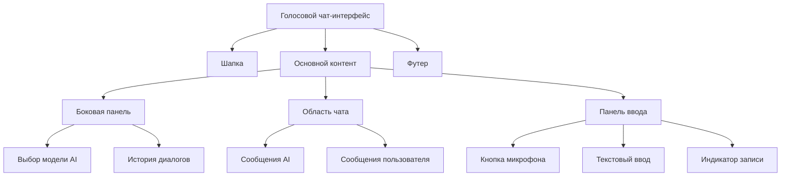
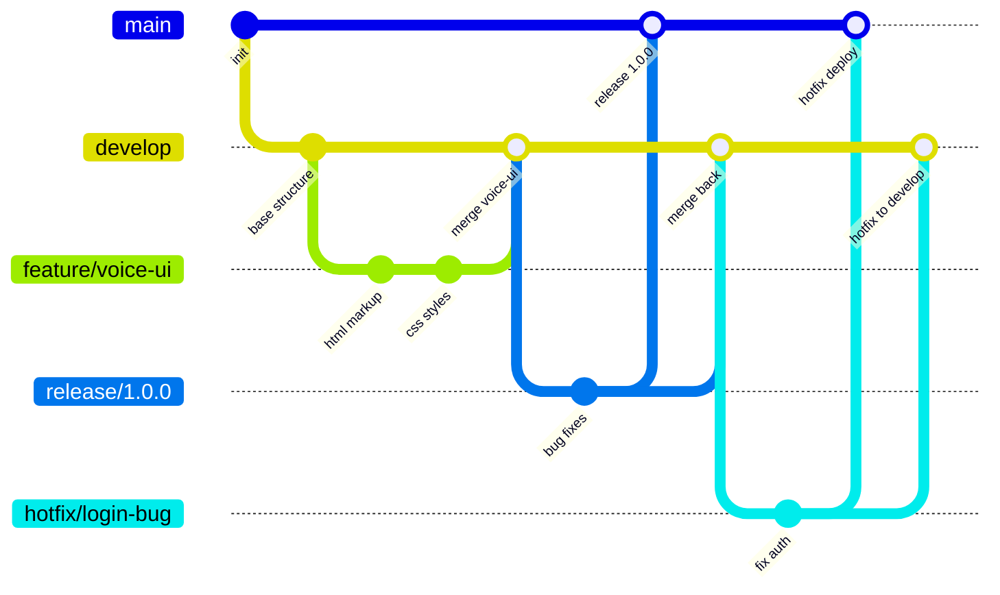

# План разметки голосового чат-интерфейса

## Описание проекта
Голосовой интерфейс в виде чат-мессенджера, где:
- Пользователь говорит, речь сразу преобразуется в текст и отображается как сообщение
- Любая модель (AI) может отвечать на сообщения
- Интерфейс похож на современные мессенджеры (Telegram, WhatsApp) с голосовым вводом

## Компоненты интерфейса

### Основные секции
1. **Header (шапка)**
   - Заголовок приложения
   - Кнопка настроек (язык, модель, параметры)
   - Индикатор подключения

2. **Chat Area (область чата)**
   - Контейнер сообщений с прокруткой
   - Сообщения пользователя (справа)
   - Сообщения модели (слева)
   - Временные метки
   - Статус доставки/прочтения

3. **Input Panel (панель ввода)**
   - Кнопка активации микрофона (основной элемент)
   - Текстовое поле для ручного ввода
   - Кнопка отправки текста
   - Индикатор записи (анимация волны)
   - Переключатель режима (голос/текст)

4. **Sidebar (боковая панель, опционально)**
   - Выбор модели AI
   - История диалогов
   - Настройки голоса

## Структура HTML

```html
<!DOCTYPE html>
<html lang="ru">
<head>
    <meta charset="UTF-8">
    <meta name="viewport" content="width=device-width, initial-scale=1.0">
    <title>Голосовой чат-интерфейс</title>
    <link rel="stylesheet" href="css/styles.css">
    <link rel="stylesheet" href="https://cdnjs.cloudflare.com/ajax/libs/font-awesome/6.4.0/css/all.min.css">
</head>
<body>
    <div class="app-container">
        <!-- Шапка -->
        <header class="app-header">
            <div class="header-left">
                <h1><i class="fas fa-microphone-alt"></i> Голосовой чат</h1>
                <span class="connection-status"><i class="fas fa-circle"></i> Подключено</span>
            </div>
            <div class="header-right">
                <button class="btn-icon" id="settings-btn" title="Настройки">
                    <i class="fas fa-cog"></i>
                </button>
                <button class="btn-icon" id="history-btn" title="История">
                    <i class="fas fa-history"></i>
                </button>
            </div>
        </header>

        <!-- Основной контент -->
        <main class="main-content">
            <!-- Боковая панель (опционально) -->
            <aside class="sidebar" id="sidebar">
                <div class="sidebar-section">
                    <h3><i class="fas fa-robot"></i> Модель AI</h3>
                    <select id="model-select">
                        <option value="gpt-4">GPT-4</option>
                        <option value="claude">Claude</option>
                        <option value="gemini">Gemini</option>
                        <option value="local">Локальная модель</option>
                    </select>
                </div>
                <div class="sidebar-section">
                    <h3><i class="fas fa-comments"></i> История</h3>
                    <ul class="history-list" id="history-list">
                        <li>Сегодня 10:30</li>
                        <li>Вчера 15:45</li>
                        <li>12 мая 2025</li>
                    </ul>
                </div>
            </aside>

            <!-- Область чата -->
            <section class="chat-area">
                <div class="chat-messages" id="chat-messages">
                    <!-- Сообщения будут добавляться динамически -->
                    <div class="message ai-message">
                        <div class="message-avatar">
                            <i class="fas fa-robot"></i>
                        </div>
                        <div class="message-content">
                            <p>Привет! Я ваш голосовой помощник. Нажмите на микрофон и говорите.</p>
                            <span class="message-time">10:00</span>
                        </div>
                    </div>
                    <div class="message user-message">
                        <div class="message-avatar">
                            <i class="fas fa-user"></i>
                        </div>
                        <div class="message-content">
                            <p>Привет, как дела?</p>
                            <span class="message-time">10:01</span>
                        </div>
                    </div>
                </div>

                <!-- Панель ввода -->
                <div class="input-panel">
                    <div class="input-group">
                        <button class="btn-microphone" id="microphone-btn">
                            <i class="fas fa-microphone"></i>
                            <span class="btn-text">Говорите</span>
                        </button>
                        <div class="recording-indicator" id="recording-indicator">
                            <div class="wave"></div>
                            <div class="wave"></div>
                            <div class="wave"></div>
                        </div>
                        <input type="text" id="text-input" placeholder="Или введите текст вручную...">
                        <button class="btn-send" id="send-btn">
                            <i class="fas fa-paper-plane"></i>
                        </button>
                    </div>
                    <div class="input-options">
                        <label class="switch">
                            <input type="checkbox" id="voice-toggle" checked>
                            <span class="slider"></span>
                            <span class="switch-label">Голосовой режим</span>
                        </label>
                        <button class="btn-small" id="clear-btn">
                            <i class="fas fa-trash"></i> Очистить
                        </button>
                    </div>
                </div>
            </section>
        </main>

        <!-- Футер -->
        <footer class="app-footer">
            <p>Голосовой интерфейс &copy; 2025 | Используется Web Speech API</p>
        </footer>
    </div>

    <script src="js/app.js"></script>
</body>
</html>
```

## Структура каталогов проекта

```
voice-interface/
├── index.html
├── css/
│   └── styles.css
├── js/
│   └── app.js
├── assets/
│   ├── icons/
│   └── sounds/
├── plans/
│   └── voice-interface-plan.md
├── .gitignore
└── README.md
```

## Базовые CSS стили

```css
/* styles.css - базовые стили для голосового чат-интерфейса */

/* Сброс и базовые стили */
* {
    margin: 0;
    padding: 0;
    box-sizing: border-box;
    font-family: 'Segoe UI', Tahoma, Geneva, Verdana, sans-serif;
}

body {
    background: linear-gradient(135deg, #1a1a2e 0%, #16213e 100%);
    color: #e0e0e0;
    min-height: 100vh;
    display: flex;
    justify-content: center;
    align-items: center;
    padding: 20px;
}

.app-container {
    width: 100%;
    max-width: 1400px;
    height: 90vh;
    background: rgba(25, 25, 35, 0.9);
    border-radius: 20px;
    overflow: hidden;
    box-shadow: 0 15px 35px rgba(0, 0, 0, 0.5);
    display: flex;
    flex-direction: column;
}

/* Шапка */
.app-header {
    display: flex;
    justify-content: space-between;
    align-items: center;
    padding: 20px 30px;
    background: rgba(40, 40, 60, 0.8);
    border-bottom: 1px solid #444;
}

.header-left h1 {
    font-size: 1.8rem;
    color: #4fc3f7;
}

.header-left h1 i {
    margin-right: 10px;
}

.connection-status {
    font-size: 0.9rem;
    color: #81c784;
    margin-left: 15px;
}

.connection-status i {
    font-size: 0.7rem;
    margin-right: 5px;
}

.header-right {
    display: flex;
    gap: 15px;
}

.btn-icon {
    background: rgba(255, 255, 255, 0.1);
    border: none;
    color: #b0b0b0;
    width: 40px;
    height: 40px;
    border-radius: 50%;
    cursor: pointer;
    font-size: 1.2rem;
    transition: all 0.3s;
}

.btn-icon:hover {
    background: rgba(79, 195, 247, 0.3);
    color: #4fc3f7;
    transform: scale(1.1);
}

/* Основной контент */
.main-content {
    display: flex;
    flex: 1;
    overflow: hidden;
}

/* Боковая панель */
.sidebar {
    width: 250px;
    background: rgba(30, 30, 45, 0.9);
    border-right: 1px solid #444;
    padding: 20px;
    overflow-y: auto;
}

.sidebar-section {
    margin-bottom: 30px;
}

.sidebar-section h3 {
    color: #bb86fc;
    margin-bottom: 15px;
    font-size: 1.1rem;
}

.sidebar-section select {
    width: 100%;
    padding: 10px;
    background: rgba(255, 255, 255, 0.1);
    border: 1px solid #555;
    border-radius: 8px;
    color: #e0e0e0;
    font-size: 1rem;
}

.history-list {
    list-style: none;
}

.history-list li {
    padding: 10px;
    background: rgba(255, 255, 255, 0.05);
    margin-bottom: 8px;
    border-radius: 6px;
    cursor: pointer;
    transition: background 0.3s;
}

.history-list li:hover {
    background: rgba(79, 195, 247, 0.2);
}

/* Область чата */
.chat-area {
    flex: 1;
    display: flex;
    flex-direction: column;
    padding: 20px;
}

.chat-messages {
    flex: 1;
    overflow-y: auto;
    padding: 20px;
    background: rgba(20, 20, 30, 0.7);
    border-radius: 15px;
    margin-bottom: 20px;
}

.message {
    display: flex;
    margin-bottom: 25px;
    max-width: 80%;
}

.ai-message {
    align-self: flex-start;
}

.user-message {
    align-self: flex-end;
    flex-direction: row-reverse;
}

.message-avatar {
    width: 40px;
    height: 40px;
    border-radius: 50%;
    background: #3f51b5;
    display: flex;
    align-items: center;
    justify-content: center;
    font-size: 1.2rem;
    margin: 0 15px;
}

.ai-message .message-avatar {
    background: #7b1fa2;
}

.user-message .message-avatar {
    background: #0277bd;
}

.message-content {
    background: rgba(255, 255, 255, 0.1);
    padding: 15px;
    border-radius: 15px;
    position: relative;
    max-width: 100%;
}

.ai-message .message-content {
    background: rgba(123, 31, 162, 0.3);
    border-top-left-radius: 5px;
}

.user-message .message-content {
    background: rgba(2, 119, 189, 0.3);
    border-top-right-radius: 5px;
}

.message-content p {
    margin-bottom: 8px;
    line-height: 1.5;
}

.message-time {
    font-size: 0.8rem;
    color: #aaa;
    display: block;
    text-align: right;
}

/* Панель ввода */
.input-panel {
    background: rgba(40, 40, 60, 0.8);
    padding: 20px;
    border-radius: 15px;
}

.input-group {
    display: flex;
    align-items: center;
    gap: 15px;
    margin-bottom: 15px;
}

.btn-microphone {
    background: linear-gradient(135deg, #ff4081, #f50057);
    border: none;
    color: white;
    padding: 15px 25px;
    border-radius: 50px;
    font-size: 1.1rem;
    cursor: pointer;
    display: flex;
    align-items: center;
    gap: 10px;
    transition: all 0.3s;
}

.btn-microphone:hover {
    transform: scale(1.05);
    box-shadow: 0 5px 15px rgba(245, 0, 87, 0.4);
}

.btn-microphone.recording {
    background: linear-gradient(135deg, #f44336, #d32f2f);
    animation: pulse 1.5s infinite;
}

@keyframes pulse {
    0% { box-shadow: 0 0 0 0 rgba(244, 67, 54, 0.7); }
    70% { box-shadow: 0 0 0 10px rgba(244, 67, 54, 0); }
    100% { box-shadow: 0 0 0 0 rgba(244, 67, 54, 0); }
}

.recording-indicator {
    display: none;
    align-items: center;
    gap: 5px;
}

.recording-indicator.active {
    display: flex;
}

.wave {
    width: 6px;
    height: 20px;
    background: #ff4081;
    border-radius: 3px;
    animation: wave 1s ease-in-out infinite;
}

.wave:nth-child(2) { animation-delay: 0.2s; }
.wave:nth-child(3) { animation-delay: 0.4s; }

@keyframes wave {
    0%, 100% { height: 10px; }
    50% { height: 20px; }
}

#text-input {
    flex: 1;
    padding: 15px;
    background: rgba(255, 255, 255, 0.1);
    border: 1px solid #555;
    border-radius: 10px;
    color: #e0e0e0;
    font-size: 1rem;
}

#text-input:focus {
    outline: none;
    border-color: #4fc3f7;
}

.btn-send {
    background: #4fc3f7;
    border: none;
    color: white;
    width: 50px;
    height: 50px;
    border-radius: 50%;
    font-size: 1.2rem;
    cursor: pointer;
    transition: all 0.3s;
}

.btn-send:hover {
    background: #29b6f6;
    transform: rotate(15deg);
}

.input-options {
    display: flex;
    justify-content: space-between;
    align-items: center;
}

.switch {
    position: relative;
    display: inline-block;
    width: 60px;
    height: 30px;
}

.switch input {
    opacity: 0;
    width: 0;
    height: 0;
}

.slider {
    position: absolute;
    cursor: pointer;
    top: 0;
    left: 0;
    right: 0;
    bottom: 0;
    background-color: #555;
    transition: .4s;
    border-radius: 34px;
}

.slider:before {
    position: absolute;
    content: "";
    height: 22px;
    width: 22px;
    left: 4px;
    bottom: 4px;
    background-color: white;
    transition: .4s;
    border-radius: 50%;
}

input:checked + .slider {
    background-color: #4fc3f7;
}

input:checked + .slider:before {
    transform: translateX(30px);
}

.switch-label {
    margin-left: 10px;
    font-size: 0.9rem;
}

.btn-small {
    background: rgba(255, 255, 255, 0.1);
    border: 1px solid #666;
    color: #e0e0e0;
    padding: 8px 15px;
    border-radius: 8px;
    cursor: pointer;
    font-size: 0.9rem;
    transition: all 0.3s;
}

.btn-small:hover {
    background: rgba(244, 67, 54, 0.3);
    border-color: #f44336;
}

/* Футер */
.app-footer {
    text-align: center;
    padding: 15px;
    background: rgba(40, 40, 60, 0.8);
    border-top: 1px solid #444;
    font-size: 0.9rem;
    color: #aaa;
}

/* Адаптивность */
@media (max-width: 1024px) {
    .sidebar {
        width: 200px;
    }
}

@media (max-width: 768px) {
    .sidebar {
        display: none;
    }
    
    .message {
        max-width: 90%;
    }
    
    .input-group {
        flex-wrap: wrap;
    }
    
    .btn-microphone {
        order: 1;
        flex: 1;
    }
    
    #text-input {
        order: 2;
        width: 100%;
        margin-top: 10px;
    }
    
    .btn-send {
        order: 3;
        margin-top: 10px;
    }
}
```

## GitFlow конфигурация

### Структура веток
- `main` - стабильная версия (продакшн)
- `develop` - основная ветка разработки
- `feature/*` - ветки для новых функций
- `release/*` - подготовка релизов
- `hotfix/*` - срочные исправления в продакшне

### Команды для инициализации GitFlow

```bash
# Инициализация Git репозитория
git init
git add .
git commit -m "Initial commit: голосовой чат-интерфейс"

# Установка GitFlow (если не установлен)
# Для Linux:
sudo apt-get install git-flow

# Инициализация GitFlow
git flow init -d

# Создание ветки для разработки интерфейса
git flow feature start voice-ui

# После завершения работы над фичей
git flow feature finish voice-ui

# Создание релизной ветки
git flow release start 1.0.0

# Завершение релиза
git flow release finish 1.0.0
```

### Файл .gitignore

```gitignore
# Логи
*.log
npm-debug.log*
yarn-debug.log*
yarn-error.log*

# Временные файлы
.DS_Store
*.swp
*.swo
*~

# Зависимости
node_modules/
bower_components/

# Сборка
dist/
build/
out/

# IDE
.vscode/
.idea/
*.suo
*.ntvs*
*.njsproj
*.sln
*.sw?

# Окружение
.env
.env.local
.env.development.local
.env.test.local
.env.production.local

# Другое
*.tmp
*.temp
```

### Скрипт инициализации проекта (setup.sh)

```bash
#!/bin/bash

echo "Настройка проекта голосового интерфейса..."

# Создание структуры каталогов
mkdir -p css js assets/icons assets/sounds plans

# Создание файлов
touch index.html css/styles.css js/app.js README.md .gitignore

# Инициализация Git
git init
git flow init -d

# Установка начального коммита
git add .
git commit -m "Initial project structure"

echo "Проект готов к работе!"
```

## Следующие шаги

### 1. Создать структуру каталогов
```bash
mkdir -p voice-interface/{css,js,assets/{icons,sounds},plans}
cd voice-interface
```

### 2. Написать файл `index.html` с приведенной выше разметкой

### 3. Создать базовые CSS стили в `css/styles.css`

### 4. Написать минимальный JavaScript для управления голосовым вводом
Примерный план для `js/app.js`:
- Инициализация Web Speech API
- Обработка нажатия кнопки микрофона
- Отображение распознанного текста в чате
- Отправка текста модели AI (заглушка)
- Получение и отображение ответа AI

### 5. Настроить GitFlow для управления ветками
Выполнить команды из раздела "Команды для инициализации GitFlow"

### 6. Добавить документацию по развертыванию
Создать `README.md` с инструкциями по запуску и развертыванию

## Диаграмма компонентов



## Диаграмма GitFlow



## Заключение
План содержит полную разметку для голосового чат-интерфейса, включая HTML структуру, CSS стили, организацию проекта и GitFlow конфигурацию. Следующим шагом является реализация этого плана в режиме Code.