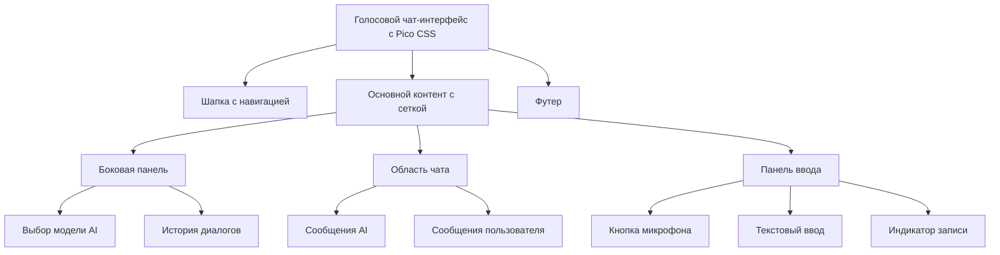

# План разметки голосового чат-интерфейса с Pico CSS

## Описание проекта
Голосовой интерфейс в виде чат-мессенджера, где:
- Пользователь говорит, речь сразу преобразуется в текст и отображается как сообщение
- Любая модель (AI) может отвечать на сообщения
- Интерфейс похож на современные мессенджеры (Telegram, WhatsApp) с голосовым вводом
- **Используется Pico CSS** для минималистичных, семантических стилей

## Pico CSS Интеграция
Pico CSS - минималистичный CSS фреймворк, который обеспечивает:
- Семантические стили для стандартных HTML элементов
- Темную тему по умолчанию
- Адаптивный дизайн
- Минимальные кастомные CSS

### Преимущества использования Pico CSS:
1. Меньше кастомного CSS кода
2. Согласованный внешний вид
3. Улучшенная доступность
4. Быстрая разработка

## Компоненты интерфейса

### Основные секции
1. **Header (шапка)**
   - Заголовок приложения
   - Кнопка настроек (язык, модель, параметры)
   - Индикатор подключения

2. **Chat Area (область чата)**
   - Контейнер сообщений с прокруткой
   - Сообщения пользователя (справа)
   - Сообщения модели (слева)
   - Временные метки
   - Статус доставки/прочтения

3. **Input Panel (панель ввода)**
   - Кнопка активации микрофона (основной элемент)
   - Текстовое поле для ручного ввода
   - Кнопка отправки текста
   - Индикатор записи (анимация волны)
   - Переключатель режима (голос/текст)

4. **Sidebar (боковая панель, опционально)**
   - Выбор модели AI
   - История диалогов
   - Настройки голоса

## Структура HTML с Pico CSS

```html
<!DOCTYPE html>
<html lang="ru" data-theme="dark">
<head>
    <meta charset="UTF-8">
    <meta name="viewport" content="width=device-width, initial-scale=1.0">
    <title>Голосовой чат-интерфейс</title>
    <!-- Pico CSS -->
    <link rel="stylesheet" href="https://cdn.jsdelivr.net/npm/@picocss/pico@1/css/pico.min.css">
    <!-- Font Awesome для иконок -->
    <link rel="stylesheet" href="https://cdnjs.cloudflare.com/ajax/libs/font-awesome/6.4.0/css/all.min.css">
    <!-- Минимальные кастомные стили -->
    <link rel="stylesheet" href="css/custom.css">
</head>
<body>
    <div class="container">
        <!-- Шапка -->
        <header class="header">
            <nav class="container-fluid">
                <ul>
                    <li><strong><i class="fas fa-microphone-alt"></i> Голосовой чат</strong></li>
                </ul>
                <ul>
                    <li><span class="badge" id="connection-status"><i class="fas fa-circle"></i> Подключено</span></li>
                    <li><button class="secondary" id="settings-btn" title="Настройки"><i class="fas fa-cog"></i></button></li>
                    <li><button class="secondary" id="history-btn" title="История"><i class="fas fa-history"></i></button></li>
                </ul>
            </nav>
        </header>

        <!-- Основной контент -->
        <main class="main-content">
            <div class="grid">
                <!-- Боковая панель -->
                <aside class="sidebar">
                    <article>
                        <header><h4><i class="fas fa-robot"></i> Модель AI</h4></header>
                        <select id="model-select">
                            <option value="gpt-4">GPT-4</option>
                            <option value="claude">Claude</option>
                            <option value="gemini">Gemini</option>
                            <option value="local">Локальная модель</option>
                        </select>
                    </article>
                    
                    <article>
                        <header><h4><i class="fas fa-comments"></i> История</h4></header>
                        <ul id="history-list">
                            <li><a href="#" class="secondary">Сегодня 10:30</a></li>
                            <li><a href="#" class="secondary">Вчера 15:45</a></li>
                            <li><a href="#" class="secondary">12 мая 2025</a></li>
                        </ul>
                    </article>
                </aside>

                <!-- Область чата -->
                <section class="chat-area">
                    <div class="chat-messages" id="chat-messages">
                        <!-- Сообщения будут добавляться динамически -->
                        <article class="message ai-message">
                            <header>
                                <div class="message-header">
                                    <i class="fas fa-robot"></i>
                                    <strong>AI Ассистент</strong>
                                    <small>10:00</small>
                                </div>
                            </header>
                            <p>Привет! Я ваш голосовой помощник. Нажмите на микрофон и говорите.</p>
                        </article>
                        
                        <article class="message user-message">
                            <header>
                                <div class="message-header">
                                    <i class="fas fa-user"></i>
                                    <strong>Вы</strong>
                                    <small>10:01</small>
                                </div>
                            </header>
                            <p>Привет, как дела?</p>
                        </article>
                    </div>

                    <!-- Панель ввода -->
                    <div class="input-panel">
                        <div class="grid">
                            <div class="input-group">
                                <button class="primary" id="microphone-btn">
                                    <i class="fas fa-microphone"></i>
                                    <span>Говорите</span>
                                </button>
                                <div class="recording-indicator" id="recording-indicator">
                                    <div class="wave"></div>
                                    <div class="wave"></div>
                                    <div class="wave"></div>
                                </div>
                                <input type="text" id="text-input" placeholder="Или введите текст вручную...">
                                <button class="secondary" id="send-btn">
                                    <i class="fas fa-paper-plane"></i>
                                </button>
                            </div>
                        </div>
                        
                        <div class="grid">
                            <div class="input-options">
                                <label>
                                    <input type="checkbox" id="voice-toggle" checked role="switch">
                                    Голосовой режим
                                </label>
                                <button class="outline" id="clear-btn">
                                    <i class="fas fa-trash"></i> Очистить
                                </button>
                            </div>
                        </div>
                    </div>
                </section>
            </div>
        </main>

        <!-- Футер -->
        <footer class="footer">
            <small>Голосовой интерфейс &copy; 2025 | Используется Web Speech API</small>
        </footer>
    </div>

    <script src="js/app.js"></script>
</body>
</html>
```

## Структура каталогов проекта (упрощенная)

```
voice-interface/
├── index.html
├── css/
│   └── custom.css          # Минимальные кастомные стили
├── js/
│   └── app.js
├── assets/
│   ├── icons/
│   └── sounds/
├── plans/
│   └── voice-interface-plan.md
├── .gitignore
└── README.md
```

## Минимальные кастомные CSS стили (custom.css)

```css
/* custom.css - минимальные кастомные стили для голосового чат-интерфейса */

/* Переменные для цветов */
:root {
    --ai-color: #7b1fa2;
    --user-color: #0277bd;
    --recording-color: #f44336;
}

/* Общие стили для контейнера */
.container {
    max-width: 1400px;
    margin: 0 auto;
    padding: 1rem;
}

/* Шапка */
.header nav {
    padding: 1rem 0;
    border-bottom: 1px solid var(--pico-border-color);
}

.badge {
    background-color: var(--pico-success-background-color);
    color: var(--pico-success-color);
    padding: 0.25rem 0.5rem;
    border-radius: 0.5rem;
    font-size: 0.875rem;
}

/* Основной контент */
.main-content {
    margin-top: 1rem;
}

.grid {
    display: grid;
    grid-template-columns: 250px 1fr;
    gap: 1.5rem;
}

@media (max-width: 768px) {
    .grid {
        grid-template-columns: 1fr;
    }
    
    .sidebar {
        display: none;
    }
}

/* Боковая панель */
.sidebar article {
    margin-bottom: 1.5rem;
}

/* Область чата */
.chat-area {
    display: flex;
    flex-direction: column;
    height: 70vh;
}

.chat-messages {
    flex: 1;
    overflow-y: auto;
    padding: 1rem;
    background-color: var(--pico-background-color);
    border-radius: var(--pico-border-radius);
    border: 1px solid var(--pico-border-color);
    margin-bottom: 1rem;
}

/* Сообщения */
.message {
    margin-bottom: 1.5rem;
    padding: 1rem;
    border-radius: var(--pico-border-radius);
    border: 1px solid var(--pico-border-color);
}

.ai-message {
    background-color: color-mix(in srgb, var(--ai-color) 10%, transparent);
    border-left: 4px solid var(--ai-color);
}

.user-message {
    background-color: color-mix(in srgb, var(--user-color) 10%, transparent);
    border-right: 4px solid var(--user-color);
    margin-left: auto;
    max-width: 80%;
}

.message-header {
    display: flex;
    align-items: center;
    gap: 0.5rem;
    margin-bottom: 0.5rem;
}

.message-header i {
    font-size: 1.25rem;
}

.message-header small {
    margin-left: auto;
    opacity: 0.7;
}

/* Панель ввода */
.input-panel {
    background-color: var(--pico-background-color);
    padding: 1rem;
    border-radius: var(--pico-border-radius);
    border: 1px solid var(--pico-border-color);
}

.input-group {
    display: flex;
    gap: 0.75rem;
    align-items: center;
    margin-bottom: 1rem;
}

#microphone-btn {
    display: flex;
    align-items: center;
    gap: 0.5rem;
    min-width: 120px;
}

#microphone-btn.recording {
    background-color: var(--recording-color);
    animation: pulse 1.5s infinite;
}

@keyframes pulse {
    0% { box-shadow: 0 0 0 0 rgba(244, 67, 54, 0.7); }
    70% { box-shadow: 0 0 0 10px rgba(244, 67, 54, 0); }
    100% { box-shadow: 0 0 0 0 rgba(244, 67, 54, 0); }
}

.recording-indicator {
    display: none;
    align-items: center;
    gap: 0.25rem;
}

.recording-indicator.active {
    display: flex;
}

.wave {
    width: 4px;
    height: 16px;
    background-color: var(--recording-color);
    border-radius: 2px;
    animation: wave 1s ease-in-out infinite;
}

.wave:nth-child(2) { animation-delay: 0.2s; }
.wave:nth-child(3) { animation-delay: 0.4s; }

@keyframes wave {
    0%, 100% { height: 8px; }
    50% { height: 16px; }
}

#text-input {
    flex: 1;
}

.input-options {
    display: flex;
    justify-content: space-between;
    align-items: center;
}

/* Футер */
.footer {
    margin-top: 2rem;
    padding-top: 1rem;
    border-top: 1px solid var(--pico-border-color);
    text-align: center;
    opacity: 0.7;
}
```

## GitFlow конфигурация

### Структура веток
- `main` - стабильная версия (продакшн)
- `develop` - основная ветка разработки
- `feature/*` - ветки для новых функций
- `release/*` - подготовка релизов
- `hotfix/*` - срочные исправления в продакшне

### Команды для инициализации GitFlow

```bash
# Инициализация Git репозитория
git init
git add .
git commit -m "Initial commit: голосовой чат-интерфейс с Pico CSS"

# Установка GitFlow (если не установлен)
# Для Linux:
sudo apt-get install git-flow

# Инициализация GitFlow
git flow init -d

# Создание ветки для разработки интерфейса
git flow feature start voice-ui-pico

# После завершения работы над фичей
git flow feature finish voice-ui-pico
```

### Файл .gitignore

```gitignore
# Логи
*.log
npm-debug.log*
yarn-debug.log*
yarn-error.log*

# Временные файлы
.DS_Store
*.swp
*.swo
*~

# Зависимости
node_modules/
bower_components/

# Сборка
dist/
build/
out/

# IDE
.vscode/
.idea/
*.suo
*.ntvs*
*.njsproj
*.sln
*.sw?

# Окружение
.env
.env.local
.env.development.local
.env.test.local
.env.production.local

# Другое
*.tmp
*.temp
```

## Следующие шаги

### 1. Создать структуру каталогов
```bash
mkdir -p voice-interface/{css,js,assets/{icons,sounds},plans}
cd voice-interface
```

### 2. Написать файл `index.html` с приведенной выше разметкой

### 3. Создать минимальные CSS стили в `css/custom.css`

### 4. Написать минимальный JavaScript для управления голосовым вводом
Примерный план для `js/app.js`:
- Инициализация Web Speech API
- Обработка нажатия кнопки микрофона
- Отображение распознанного текста в чате
- Отправка текста модели AI (заглушка)
- Получение и отображение ответа AI

### 5. Настроить GitFlow для управления ветками
Выполнить команды из раздела "Команды для инициализации GitFlow"

### 6. Добавить документацию по развертыванию
Создать `README.md` с инструкциями по запуску и развертыванию

## Преимущества использования Pico CSS для этого проекта

1. **Минимализм**: Pico CSS предоставляет чистые, семантические стили без излишеств
2. **Темная тема по умолчанию**: Идеально подходит для голосового интерфейса
3. **Адаптивность**: Встроенная адаптивная сетка и компоненты
4. **Доступность**: Улучшенная доступность из коробки
5. **Быстрая разработка**: Меньше времени на стилизацию, больше на функциональность

## Диаграмма компонентов



## Заключение
План содержит полную разметку для голосового чат-интерфейса с использованием Pico CSS. Этот подход обеспечивает минималистичный, семантический и доступный интерфейс с минимальными кастомными CSS. Следующим шагом является реализация этого плана в режиме Code.